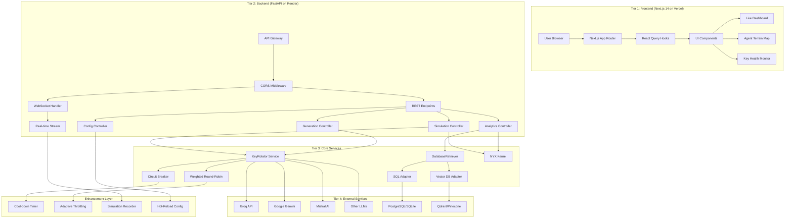
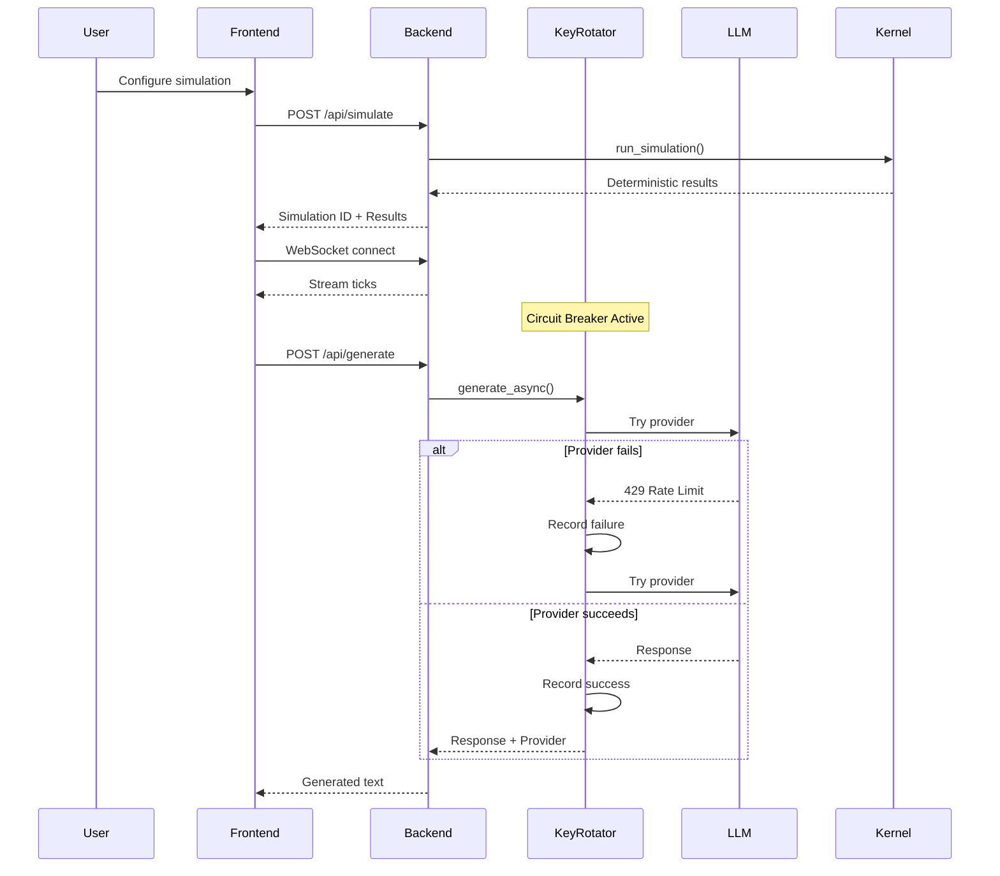

# NYX Phoenix Migration - Architecture Diagram

## N-Tier Decoupled Architecture



## Data Flow Sequence



## Component Responsibilities

| Component | Technology | Responsibility |
|-----------|------------|----------------|
| Next.js Frontend | React 18, TypeScript | UI/UX, real-time visualization |
| FastAPI Backend | Python 3.12, AsyncIO | API orchestration, validation |
| KeyRotator | Custom | Multi-provider fallback with circuit breaker |
| DatabaseRetriever | SQLAlchemy, Vector Clients | RAG pipeline for context injection |
| NYX Kernel | Preserved from legacy | Deterministic agent simulation |
| WebSocket Server | FastAPI WebSockets | Real-time simulation streaming |

## Deployment Topology

```
┌─────────────────────────────────────────────────────────────┐
│                      VERCEL (Frontend)                       │
│  ┌──────────────────────────────────────────────────────┐   │
│  │  Next.js Static Export (dist/)                        │   │
│  │  - _redirects for SPA routing                         │   │
│  │  - vercel.json rewrites to backend                    │   │
│  └──────────────────────────────────────────────────────┘   │
└─────────────────────────────────────────────────────────────┘
                            │
                            │ HTTPS (API calls)
                            ▼
┌─────────────────────────────────────────────────────────────┐
│                   RENDER (Backend)                           │
│  ┌──────────────────────────────────────────────────────┐   │
│  │  FastAPI Application (uvicorn)                        │   │
│  │  - REST endpoints                                       │   │
│  │  - WebSocket server                                     │   │
│  │  - Background tasks                                     │   │
│  └──────────────────────────────────────────────────────┘   │
│  ┌──────────────────────────────────────────────────────┐   │
│  │  Persistent Disk (1GB)                                │   │
│  │  - SQLite database                                      │   │
│  │  - Simulation archives                                  │   │
│  └──────────────────────────────────────────────────────┘   │
└─────────────────────────────────────────────────────────────┘
                            │
                            │ API Calls
                            ▼
┌─────────────────────────────────────────────────────────────┐
│                  EXTERNAL APIS                               │
│  - Groq, Google, Mistral, etc. (LLM providers)              │
│  - Qdrant/Pinecone (Vector databases)                       │
└─────────────────────────────────────────────────────────────┘
```

## Security Boundaries

```
┌─────────────────────────────────────────────────────────┐
│                    SECURITY ZONES                        │
├─────────────────────────────────────────────────────────┤
│ Zone 1: Public Internet                                  │
│ - Vercel CDN                                              │
│ - Static assets                                           │
├─────────────────────────────────────────────────────────┤
│ Zone 2: API Layer (CORS Protected)                       │
│ - FastAPI endpoints                                       │
│ - Rate limiting                                           │
│ - Input validation (Pydantic)                             │
├─────────────────────────────────────────────────────────┤
│ Zone 3: Service Layer                                    │
│ - KeyRotator (keys never exposed)                         │
│ - Circuit breaker state                                   │
├─────────────────────────────────────────────────────────┤
│ Zone 4: Environment Secrets                              │
│ - API keys via Render env vars                            │
│ - Never committed to git                                  │
└─────────────────────────────────────────────────────────┘
```
